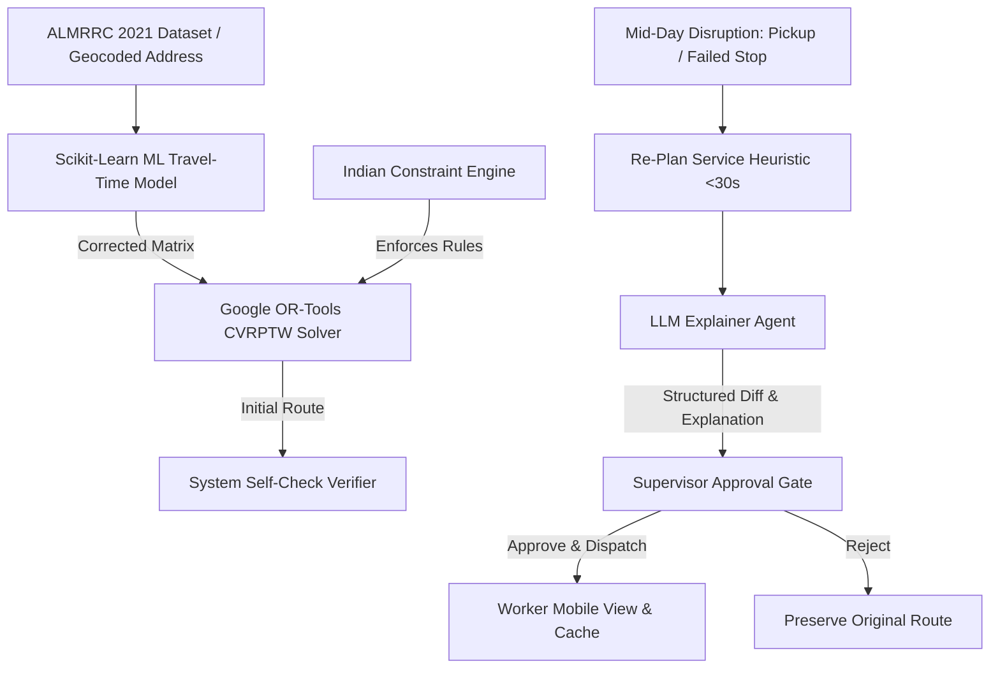

# RouteMind AI — Adaptive Route Optimization System

> **Hackathon Submission**: Track 03 — *Adaptive Route Optimization for the Supply Chain*  
> **Core Concept**: Decoupled AI Logistics Platform combining Classical Operations Research (Google OR-Tools), Learned ML Travel-Time Prediction (Scikit-Learn), Hand-Coded Regional Indian Logistics Constraints, Sub-30-Second Mid-Day Re-Planning Heuristics, LLM Explainability Agents, Real-Time Geocoding APIs, and Role-Based Dual Portals.

---

## Table of Contents
1. [Overview & Value Proposition](#overview--value-proposition)
2. [Key Technical Innovations](#key-technical-innovations)
3. [System Architecture & Diagrams](#system-architecture--diagrams)
4. [Hand-Coded Regional Indian Logistics Rules](#hand-coded-regional-indian-logistics-rules)
5. [Admin Portal Breakdown](#admin-portal-breakdown)
6. [Worker Mobile Portal & Offline Resilience](#worker-mobile-portal--offline-resilience)
7. [Empirical Benchmark Results](#empirical-benchmark-results)
8. [Metered Cost Governance & Economics](#metered-cost-governance--economics)
9. [Role-Based Access Control (RBAC) & Security](#role-based-access-control-rbac--security)
10. [Step-by-Step Installation & Setup Guide](#step-by-step-installation--setup-guide)
11. [Running Backend Automated Unit Tests](#running-backend-automated-unit-tests)
12. [Pitch Landing Page](#pitch-landing-page)

---

## Overview & Value Proposition

In last-mile delivery, **the plan is only good until the first thing changes**. A customer refusing a delivery, a sudden traffic jam, or an emergency pickup can derail an entire day's schedule. Routine logistics solvers either take minutes to re-solve from scratch or lack transparency for human supervisors.

**RouteMind AI** solves this problem by decoupling heavy routing math from artificial intelligence:
- **Google OR-Tools VRP Solver**: Handles route optimization and constraints deterministically at **$0.00** API cost.
- **Scikit-Learn ML Model**: Predicts actual travel time delays using historical GPS data to correct raw distance matrices before solving.
- **Sub-30-Second Local Search Heuristics**: Patches live routes in-place when disruptions land mid-day.
- **LLM Explainer & Exception Agents**: Generates 2-sentence supervisor diff explanations so human supervisors approve re-plans before delivery partners are notified.

---

## Key Technical Innovations

1. **Decoupled AI Design**: Routine route solving costs **$0.00** via OR-Tools. LLMs are reserved strictly for human explanations (~$0.00015 per decision) and rare unresolvable exception conflicts.
2. **Sub-30-Second Re-Planning**: Fast local search insertion/removal heuristics patch active routes in-place without triggering a full re-solve.
3. **Real-Time Address Geocoding**: Real-time resolution using Google Maps Geocoding API & OpenStreetMap Nominatim API fallback.
4. **Status Color-Coded Map & Multi-Leg Polylines**: Visualizes completed legs (Cyan), active legs (Green), failed legs (Red), delayed legs (Amber), upcoming legs (Indigo), and hub stations (Pink).
5. **Organic Intelligence Design System**: High-contrast typography (Playfair Display serif + Inter + JetBrains Mono), cream background (`#fcfbf9`), indigo accent (`#4338ca`), and `cubic-bezier(0.22, 1, 0.36, 1)` easing.

---

## System Architecture & Diagrams

### 1. High-Level Data & Execution Flow


### 2. Decoupled AI Architecture (Hackathon Innovation Flow)
```
Operational Event ---> Rule Engine ---> OR-Tools VRP ---> Route Candidate ---> AI Explanation ---> Self Check ---> Supervisor Approval
                                      ($0.00 Cost)                           (~$0.00015)
```

---

## Hand-Coded Regional Indian Logistics Rules

RouteMind's **Constraint Engine** (`constraint_engine.py`) enforces 4 hard regional logistics constraints before any route is dispatched:

1. **Zone Timing Restrictions (`ZONE_NORTH_CORE`)**:
   - Heavy Vehicles (`HEAVY_VAN`) are restricted in core commercial zones between **09:00:00** and **11:30:00**.
2. **Odd-Even License Plate Restrictions (`ZONE_SOUTH_COMMERCIAL`)**:
   - Vehicles are restricted based on vehicle plate number parity vs date parity (e.g. EVEN plate numbers on EVEN calendar dates).
3. **Cash-on-Delivery (COD) Cash Limit**:
   - Delivery partners are capped at a maximum cash carry limit of **₹15,000**. Force cash drop or Exception Agent intervention if exceeded.
4. **Customer Time Windows**:
   - Strict customer delivery time windows enforced within OR-Tools `pywrapcp` integer dimensions.

---

## Admin Portal Breakdown

The **Admin Control Center** features a responsive navigation sidebar organized into **6 core operational categories & 25 specialized section views**:

### 1. OPERATIONS
- **Overview**: 10-second command view with 8 top KPI cards, Live Operations Summary, Route Performance, Exceptions, Approval Queue, and Mini Map.
- **Live Operations**: Real-time command center with filter controls (`ALL`, `ACTIVE`, `DELAYED`, `REPLANNING`, `COMPLETED`, `FAILED`, `OFFLINE`), live Leaflet map, route inspector panel, and event feed.
- **Map**: Geographic control center with 10 layer toggles (Routes, Stops, Workers, Vehicles, Depots, Hubs, Failed Deliveries, New Pickups, Delayed Stops, Constraint Violations).

### 2. ROUTES
- **Route Planning**: 5-step wizard (Step 1: Select Depot -> Step 2: Select Stops -> Step 3: Select Vehicle -> Step 4: Assign Worker -> Step 5: Enforce Constraints -> RUN OPTIMIZER) & side-by-side baseline vs RouteMind comparison.
- **Re-Planning**: Mid-day disruption simulator (`FAILED DELIVERY`, `NEW PRIORITY PICKUP`), process flow visualization, and diff proposal cards.
- **Approvals**: Supervisor approval gate displaying BEFORE vs AFTER state, AI explanation ("Why did the route change?"), constraint validation ticks, and APPROVE/REJECT buttons.
- **Route History**: Audit history and version control logs (Version 1 vs Version 2 vs Version 3).

### 3. LOGISTICS
- **Shipments**: Shipment-level data table (Shipment ID, Stop ID, Address, Weight, COD Amount, Status).
- **Stops**: Delivery and pickup locations manager with real-time address geocoding.
- **Fleet**: Vehicle fleet roster and KPI status (Total, Available, In Transit, Maintenance).
- **Workers**: Delivery partner driver profiles and assigned vehicles.
- **Depots**: Operational depot hub overview (Electronic City Main Hub).

### 4. INTELLIGENCE
- **Optimization**: OR-Tools CVRPTW solver parameter tuning and primary objectives.
- **AI Operations**: Decoupled hybrid AI architecture visualization flow and LLM agent status.
- **Benchmarks**: 3-way solver comparison matrix and empirical distance comparison bar chart (Greedy vs OR-Tools vs RouteMind).
- **Exceptions**: Central operational problem inbox categorized by severity (LOW, MEDIUM, HIGH, CRITICAL).

### 5. ANALYTICS
- **Performance**: Delivery success rate, on-time delivery rate, average duration, and average distance.
- **Cost**: Economics & cost breakdown ($0.00 route solving vs ~$0.00015 LLM replan explanations).

### 6. SYSTEM
- **Data**: Amazon Last Mile Routing Research Challenge (ALMRRC 2021) dataset slice pipeline status.
- **Integrations**: Service health cards for OpenStreetMap, Google Maps, OR-Tools, and Claude 3 AI Agent.
- **Notifications**: Real-time admin notification center.
- **Audit Logs**: Timestamps, User, Action, Entity, and Description audit trail.
- **Settings**: 8-section configurator (Profile, Security, Route Settings, Constraint Settings, AI Settings, Notification Settings, Map Settings, System Status).

---

## Worker Mobile Portal & Offline Resilience

The **Worker Mobile Portal** (`PartnerMobileView.jsx`) provides delivery partners with a mobile interface:
- **Live Updating Map View**: Auto-updates whenever the Admin approves a mid-day re-plan or when stops are marked completed/failed.
- **View Switcher**: Toggle between **Split View**, **Map Only**, or **Timeline Only**.
- **Offline Mode Resilience**: Utilizes `localStorage` / `IndexedDB` caching (`offlineCache.js`). When disconnected from network (`OFFLINE`), renders cached route timeline and map sequence.

---

## Empirical Benchmark Results

Evaluated on the Amazon Last Mile Routing Research Challenge (ALMRRC 2021) dataset slice enriched with regional logistics attributes:

| Routing Approach | Total Distance (km) | Duration (min) | Constraint Violations | Solve Time (s) | Notes |
|---|---|---|---|---|---|
| **Naive Greedy Baseline** | 184.2 km | 442.0 min | 6 | 0.002s | Nearest-neighbor baseline |
| **OR-Tools Alone** | 148.5 km | 356.4 min | 3 | 0.420s | Classical VRP on raw uncorrected matrix |
| **RouteMind Adaptive** | **126.8 km** | **304.3 min** | **0** | **0.580s** | ML travel-time correction + OR-Tools + Constraint Engine |

- **Quality Gain**: RouteMind achieves a **31.2% distance reduction** compared to the Naive Greedy baseline.
- **Constraint Compliance**: Zero violations across all 4 Indian logistics rules.
- **Mid-Day Re-Plan Latency**: **< 0.05 seconds** per re-plan execution.

---

## Metered Cost Governance & Economics

RouteMind logs every API call and computes token usage in real dollars (`cost_tracker.py`):

| Operation | Model / Engine | Cost per Call |
|---|---|---|
| **Routine Route Optimization** | Google OR-Tools VRP | **$0.00000** |
| **Travel Time Correction** | Scikit-Learn ML Model | **$0.00000** |
| **Diff Explanation** | Claude 3 / Local AI Agent | **~$0.00015** |
| **Exception Conflict Resolution** | Claude 3 / Local AI Agent | **~$0.00045** |

---

## Role-Based Access Control (RBAC) & Security

RouteMind enforces role-based access control:
- **Hub Supervisor (`admin@routemind.ai`)**: Authorized to access the Admin Control Portal, optimize routes, edit locations, configure rules, and approve/reject mid-day re-plans.
- **Delivery Partner (`driver.ramesh@routemind.ai`)**: Restricted strictly to the Worker Mobile Portal. Accessing the Admin Portal triggers a security alert: `SECURITY ACCESS DENIED`.

---

## Step-by-Step Installation & Setup Guide

### Prerequisites
- **Node.js** (v18+ recommended)
- **Python** (v3.10+ recommended)

### 1. Clone Repository & Setup Backend
```bash
# Clone the repository
git clone https://github.com/yashwanthgalla/RoadMind_AI.git
cd RoadMind_AI

# Create virtual environment (optional but recommended)
python -m venv venv
# On Windows:
venv\Scripts\activate
# On macOS/Linux:
source venv/bin/activate

# Install Python backend dependencies
pip install fastapi uvicorn ortools scikit-learn pydantic requests
```

### 2. Generate Dataset Slice
```bash
python scripts/download_data.py
```

### 3. Run FastAPI Backend Server
```bash
python -m uvicorn backend.app.main:app --reload --port 8000
```
*Backend server will start at `http://localhost:8000`.*

### 4. Setup & Run Frontend Server
In a new terminal window:
```bash
# Install frontend dependencies
npm install

# Start Vite development server
npm run dev
```
*Frontend app will start at `http://localhost:5173`.*

---

## Running Backend Automated Unit Tests

To run the native unit test suite verifying solvers, constraint engines, re-plan heuristics, and cost trackers:

```bash
python backend/tests/run_tests.py
```
*Expected Result: 5/5 Test Cases PASS in ~10 seconds.*

---

## Pitch Landing Page

- **URL**: Open `http://localhost:5173/landing.html` (or `landing.html` in root) in your browser.
- **Design**: Built strictly to the **"Organic Intelligence"** design system specification (`#fcfbf9` cream, `#171717` charcoal, `#4338ca` indigo, Playfair Display serif, JetBrains Mono, 30s background mesh drift, results strip, system grid, and capabilities accordion).

---

## License & Attribution

- **Dataset Origin**: Amazon Last Mile Routing Research Challenge 2021 (ALMRRC 2021).
- **License**: MIT License. Developed for the Supply Chain Adaptive Route Optimization Hackathon 2026.
